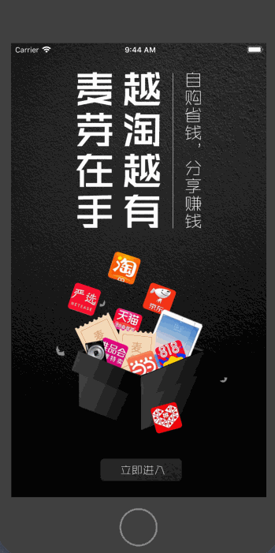
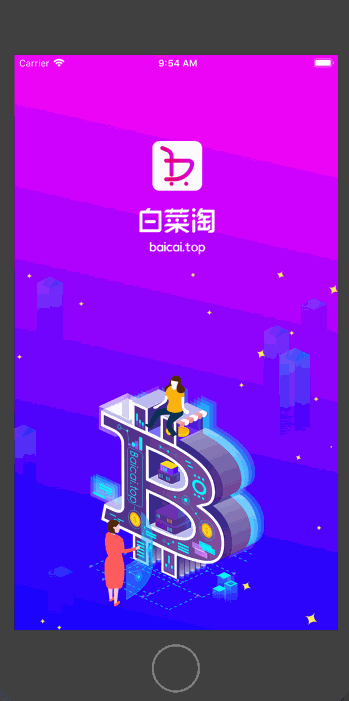

# JGTaoMall
### 声明：外接的N手项目，仅开源供大家学习使用，禁止从事商业活动，如出现一切法律问题自行承担！！！

### 说明：此工程属淘宝客，包含两个电商项目，即麦芽淘和白菜淘。项目初衷是帮助用户快速找到同淘宝客户端完全相同且含有优惠券的商品，两个项目最大区别就是UI不同，麦芽淘更显高贵时尚。项目中集成极光推送 ，三方登录（微信）,阿里百川电商SDK等等，由于项目多人接手，代码比较混乱，但功能还算比较齐全，足够初学者学习使用。

### 本机环境
    1、 开发环境：Xcode 10.2  
    2、 语言环境：swift5.0 + Objective-C 

### 项目中使用的三方
- [x]  Bugly
- [x]  SwiftyJSON
- [x]  SwiftyUserDefaults
- [x]  IQKeyboardManagerSwift
- [x]  SnapKit
- [x]  Toast
- [x]  AFNetworking
- [x]  DeviceKit
- [x]  JPush
- [x]  SVProgressHUD
- [x]  MJRefresh
- [x]  TZImagePickerController
- [x]  Masonry
- [x]  BaiduMobStatCodeless
- [x]  mob_sharesdk 、 mob_sharesdk/ShareSDKUI 、 mob_sharesdk/ShareSDKPlatforms/WeChatFull
- [x]  RxSwift
- [x]  RxCocoa
- [x]  ZFDownload
- [x]  Kingfisher
- [x]  Alamofire
- [x]  Kingfisher
- [x]  Reusable

### 效果图

    1、麦芽淘  
    * 麦芽淘集成阿里百川最新SDK4.0

    2、白菜淘

